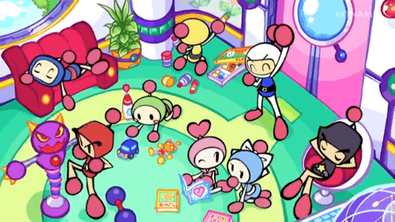

<p align="center">
    <a></a>
</p>

# Indie Studio - Time to go cross-platform

- **Binary name:** bomberman
- **Language:** C++
- **Compilation:** CMake 3.17

# Subject

The aim of the Indie Studio is to implement a cross-platform 3D video game with real-world tools.

Making an enjoyable game is just as important as writing clean code.
A working game which is no fun to play is pointless!

> :speaking_head: Let’s be honest. Implementing a video game is generally not fun (at least not all the time). But it can be, and having someone else enjoy a game you made is an amazing feeling. The result will be worth the effort, so do your best! And most importantly, have fun.

You MUST use CMake as a cross-platform build system:
    • Linux: it must generates a Makefile to be able to build the project.
    • Windows: it must generates a Visual Studio solution .sln (will be tested with Visual Studio 2019).

You also must use the [raylib](!https://www.raylib.com/) library and use assets. We don’t want to see any fighting cubes! A CMake module for raylib is provided, you MUST use it to generate your project.

You may use Boost to help you with some aspects of the project (or for bonuses).

## Nao Marvin

| Details      | Nao Marvin :robot: (%) |
| ------------- |:-------------:|
| `blabla`: xxx% \| `blabla`: xxx% \| `blabla`: xxx% | xxx% |

## Prerequisites

What you need

```
C++ Library
g++
Graphics Library
cmake
```

## Compiling

Clone the repository and go inside. Then,

```
$ cd build
$ cmake .. && cmake --build .
$ cp bomberman ../ && cd ../
$ ./bomberman
```

## Usage

```
∼/B-YEP-400> ./bomberman
```

## GAME

### BOMBERMAN


The game you must implement is a Bomberman-like game.
**Bomberman** is one of the most famous video games of all time. With over 70 franchises, ranging from the first version on MSX, ZX Spectrum and Sharp MZ-700 in 1983 to the lastest versions on modern consoles, over 10 million units have been sold.

Our gameplay reference is Neo Bomberman, released on the Neo Geo and MVS systems in 1997.

Here’s the required features :
    • Local multi-player with the possibility to play with a friend + AI’s controlled bots.
    • A main game menu (to start a new game or load an existing one).
    • Your game must feature 3D graphics but a 2D gameplay.
    • Your game must feature procedurally generated maps (random obstacles, random bonus...).
    • Save/Load a game.
    • Animation and sounds to give life to the game (especially during various interactions).
    • Think about bomb explosion, player walking, background music...
    • Some Power-ups (Bomb Up, Speed Up, Fire Up, Wall Pass).

The goal of this project is not only to code a video game, but it’s to code a fully finished video game. This means that the efforts you make to polish your game will count as much as the technical aspect.

Do your best to avoid clunky animations or graphical glitches, manage your camera in a way that the “outside” of the game is never visible, pay attention to game design, level design and sound design, add variations in ennemies and environnements, etc.

## DOCUMENTATION

To see more check into the folder ./doc.

> :speaking_head: We had to hit this project
